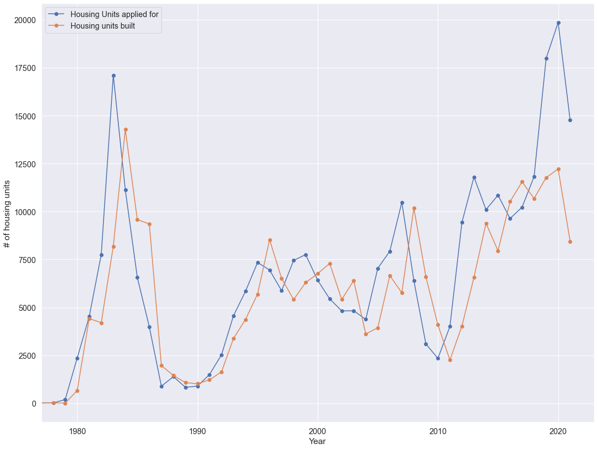

# Exploring the effects of construction delays from Covid on the Austin housing market
_This project was put together from the [Issued Construction](https://data.austintexas.gov/Building-and-Development/Issued-Construction-Permits/3syk-w9eu) Permits dataset assembled and maintained by the City of Austin._

#### When my current apartment lease was up for renewal this October, the market seemed to have changed dramatically from a year ago when buildings were offering large lease signing incentives in order to fill units. At the same time, I noticed an abundance of new construction going on around the city, so I was curious if the market mechanisms that normally keep housing supply in line with demand had been supressed by building delays from supply shortages and personnel regulations during peak Covid pandemic. Further, I wondered when could we expect the supply to get back on track. 

---

### Question 1: Has new construction been delayed during the Covid pandemic?
---

To visualize the aggregated build times for new housing, I used a simple chart showing the number of housing units applied for each year, compared to the number of housing units that are finalized each year. This chart also allows for annual new housing comparison between years, clearly showing huge booms in 1983, 2008, and right now, with busts bottoming out in 1990 and 2010. 

### Results: There is a large delay in new construction reaching the market during the Covid pandemic.
---

While it is normal to see a large difference between the issued and completed permits, (especially when demand spikes like in 1983) we expect there to be a spike in completion that follows (like in 1984). However, in 2019, when the issued permitted units spiked to a new city record, the completed units for the next year hardly go up at all. This massive gap between supply and demand also seems to line up directly with the onset of delays related to the Covid pandemic. 

---

### Question 2: When will the housing supply catch up with demand?
---

The chart below shows expected completion rates of projects currently in progress based on a k nearest neighbors model. This model helped avoid extreme completion times that were predicted with scalar regression models and shows what we would expect to have seen without Covid delays.

looking into Austin's apparent housing supply shortage. Click [here](https://github.com/nathaniel-j/Austin-Building-Boom/blob/main/austin_housing_II.ipynb)

apartment photo found [here](https://urbanize.city/austin/post/austin-area-new-apartment-construction-drops-despite-rapid-growth)
